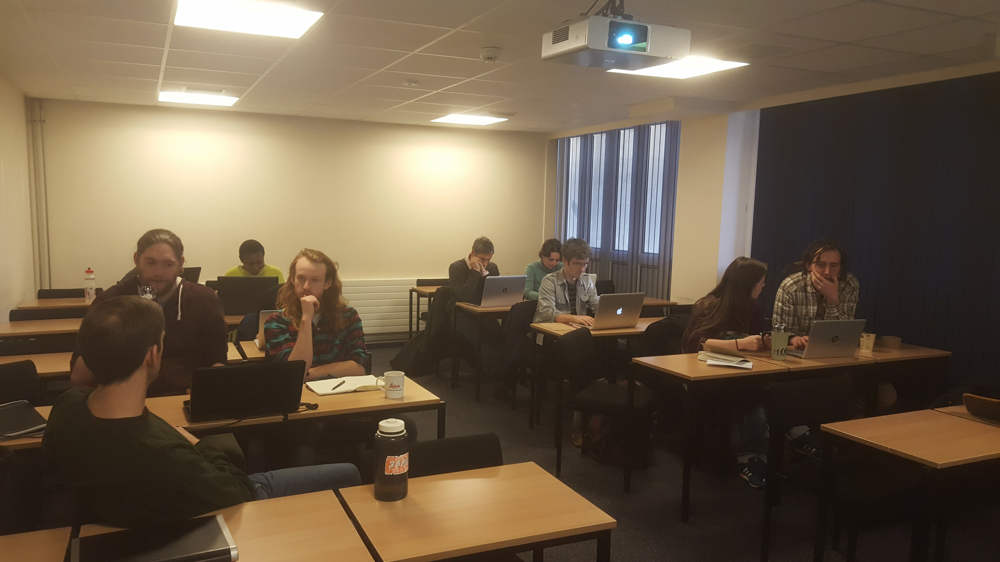

About a year ago my supervisor sent me an email regarding the [Mozilla Open Science Fellowship](https://science.mozilla.org/programs/fellowships) telling me that it was a great opportunity and that I should apply for it. At first I didn’t really understand what it was about, but the more I read about open science the more passionate I became about the concept of openness. I started feeling that the goal of making science more transparent and accessible is too important to just wait for things to turn in that direction. I started feeling the urge to do something to change the way research is done.

I know, that’s a big goal! But after the initial “I am going to change the world” superhero-kind of feeling, I started thinking about how I could make a difference in the small universe that is my department. I started talking to people about data sharing and open science practices and, after a few weeks I had already obtained the nickname of “open science girl”. I don’t know whether they were just tired of listening to my rants but people really started listening. The result of this harassment was the Aberdeen Study Group, a fun, informal meetup of friends and colleagues to share skills, stories and ideas on using code for research, and exploring open research practices (check out the project page [here](https://francescamancini.github.io/AberdeenStudyGroup/)).

I was so excited when we finally launched the project with an awesome Hacky Hour. I was very surprised by the number of “new” people that joined us in the pub and it was great to hear their ideas on how to make the study group work. Since then we have run two successful tutorials (check them out [here](https://aberdeenstudygroup.github.io/studyGroup/lessons/)) and a co-working session.

[This event](https://github.com/AberdeenStudyGroup/studyGroup/issues/8) was particularly exciting. We teamed up with the [Coding Club](https://ourcodingclub.github.io/) from Edinburgh to lead a tutorial on how to efficiently manipulate and visualise big biodiversity datasets. Around 20 people participated and we all learned something new. I really enjoyed discovering how to use pipes in R and how to write super tidy code in RStudio, but the thing I loved the most was the collaboration. A PhD sometimes can be very isolating, especially for a computer-based researcher. Sitting at your desk, staring at code all day every day with only Google to help you… I love coding but it can be a bit too much sometimes. 

That is why we need projects such as the Aberdeen Study Group or the Coding Club. An environment where we can learn without the pressure of being assessed, where we can all learn how to make our science more reproducible and change the future of academic research. Thinking about it again, that goal of changing the way research is done does not seem so unrealistic now. We just need to be persistent and create more study groups!

I want to thank [Team Shrub](https://teamshrub.wordpress.com/) for their enthusiasm and their work in putting together the tutorial and especially [Gergana Daskalova](https://adventurousandefficient.com/) without whom all of this would not have been possible. I am really looking forward to collaborating with them again!

