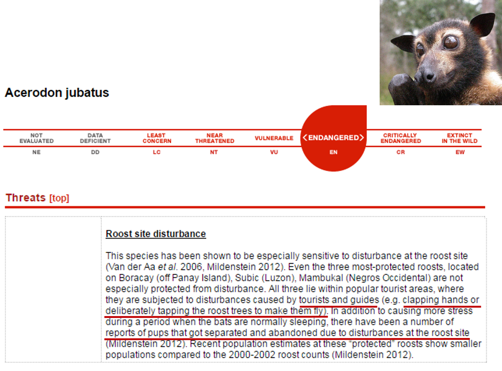

*Let’s face it, scientific papers are not written for a general audience. As much as we try to avoid it, they are full or jargon and aimed at scientists. This makes science inaccessible to a big part of the population, because our results are difficult to understand and sometimes just plain boring to read. This is why I have decided to launch “Human readable abstracts”, a series of blog posts to communicate my science to a wider audience.*

I love going on holyday, especially when I get to visit a new place. In fact, this seems to be everyone’s favourite activity, so much so that tourism is worth 10% of the global Gross Domestic Product (GDP). When I travel I like to go visit natural areas and do some fun outdoor activities, especially wildlife watching. This kind of activities are categorised as **nature-based recreation** and a lot of people are into this kind of stuff. In Scotland **nature-based tourism is worth £ 1.4 billion** and it generates **39000 jobs**, with wildlife watching alone contributing £ 127 million per year to the Scottish economy. Being an ecologist focusing on nature conservation, I am always very aware of the environmental impacts of my everyday choices, including my holyday activities. We are probably all familiar with the big **environmental impacts of tourism**: air travel emits quite a lot of CO2 and we have all seen a beautiful beach covered in litter at the end of a hot summer day etc. But there are other environmental impacts that are produced from activities that we tend to consider “sustainable”, for example wildlife watching. Surely just watching wildlife in their natural habitat cannot cause any harm? If you think that, then think again: more than **1400 endangered and critically endangered species are threatened by tourism**, either because of habitat destruction caused by tourism development or because of disturbance caused by tourists. For example, the golden-capped fruit bat *Acerodon jubatus*, endemic to the Philippines, is an endangered species, this means it is only two steps away from extinction in the International Union for Conservation of Nature (IUCN) Red List of endangered species. One of its major threats is “Roost site disturbance” caused by tourists and guides [*“clapping hands or deliberately tapping the roost trees to make them fly”*](http://www.iucnredlist.org/details/139/0). This disturbance can cause stress and interrupt the animals daily activities, especially resting, and there have been reports of pups that were abandoned as a consequence of this disturbance. This is a major concern, especially because it is a problem that affects such a large number of endangered species.

What can we do about it? Well the first step is to understand where the tourists are to identify areas and wildlife that are under pressure from these activities. This seems an easy enough question to answer, but in reality it is quite tricky to quantify visitation for wildlife watching purposes. Obtaining this data can be very expensive on a large spatial and temporal scale. Imagine designing and deploying a survey to ask people from anywhere in the world where they have been watching wildlife over the past 20 years. But, we live in a society where we love to share every aspect of our lives with the world. **Social media** like Facebook and Twitter have billions of users who are constantly sharing where they go and what they do. That is a very precious source of data! Scientists have started using this information to quantify nature-based recreation and obtain a finer resolution picture of what people value in nature. Our study just published in [PLOS ONE](http://journals.plos.org/plosone/article?id=10.1371/journal.pone.0200565), compares spatial and temporal patterns of wildlife photographs found on the photo-sharing website **Flickr** to patterns in data collected through surveys to understand if we can use this social media to quantify nature-based recreational activities in Scotland.

The answer is **“Yes we can!”**. We found that the monthly numbers of visitors to the Cairngorms National Park obtained through surveys corresponded to the monthly numbers of Flickr users taking photographs in the Cairngorms National Park and sharing them on Flickr. We also found that areas that are very popular amongst Flickr users taking photographs of wildlife in Scotland corresponded to areas popular for wildlife watching activities according to an [online Scotland-wide survey](http://www.gov.scot/Topics/marine/seamanagement/national/RecandTourism) that was released in 2015. Finally, by looking at hotspots of wildlife Flickr photographs we recognised some popular wildlife watching destinations, such as Chanonry Point in the Moray Firth, which is one of the best locations in the UK to watch bottlenose dolphins from land, and Newburgh in Aberdeenshire, an official seal haul-out site that now holds 26% of the Grey seal population of the East Coast of Scotland seal management area. This result is good news because it means that now we can easily and cheaply obtain data on nature-based recreational activities from social media instead of having to design and deploy costly surveys. This data can help us understand what people value in nature and how to sustainably develop a nature-based tourism sector. We can use it to identify areas where wildlife are under too much pressure from tourism activities and areas that have tourism potential but are underutilised and could be useful to redistribute some of that pressure.

I hope you have enjoyed reading this human readable abstract. If you want to know more about this study you can read the full paper at [PLOS ONE](http://journals.plos.org/plosone/article?id=10.1371/journal.pone.0200565). You can also get in touch with me by leaving your thoughts and questions in the comments section below, by email at r03fm14@abdn.ac.uk or find me on Twitter [@Frances_Mancini](https://twitter.com/Frances_Mancini).

Photo credits: [@Rich_Hassall](https://twitter.com/RichHassall); [IUCN](http://www.iucnredlist.org/details/139/0).
