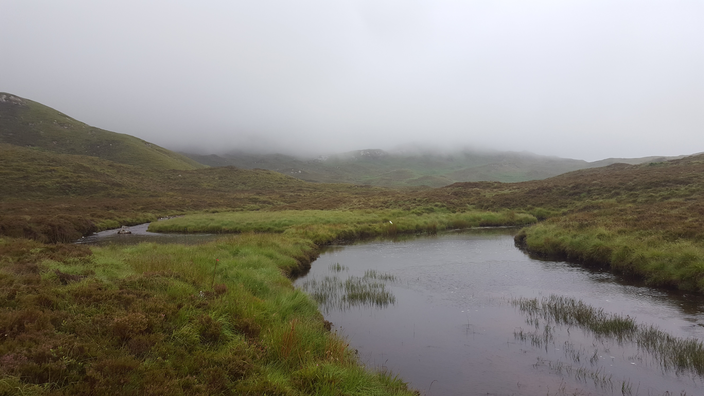

*Let’s face it, scientific papers are not written for a general audience. As much as we try to avoid it, they are full or jargon and aimed at scientists. This makes science inaccessible to a big part of the population, because our results are difficult to understand and sometimes just plain boring to read. This is why I have decided to launch “Human readable abstracts”, a series of blog posts to communicate my science to a wider audience.*

When was the last time you went for a walk in nature? Can you remember where you went and what made you decide to go there instead of somewhere else? Understanding why people decide to visit certain natural areas instead of others is important because **the recreational value of landscapes and natural areas is often used to generate support for investing public money into their conservation**. However, we don’t know if people place greater recreational value in areas that are important for conservation compared to other green spaces. In addition, nature recreational activities, if not managed properly, can be harmful for the environment. If recreational hotspots and areas of high conservation value overlap, it might be necessary to put in place protection measures to minimise the negative effects of these activities on the environment.

If you have read my [latest Human Readable Abstract](https://francescamancini.github.io/HRA1/), you know how difficult it is to quantify nature recreational activities on large scales and at a fine resolution, and that **social media** are a very useful tool to deal with the lack of data on these activities. In [our latest paper](https://besjournals.onlinelibrary.wiley.com/doi/full/10.1111/1365-2664.13274), my co-authors and I used data from the social media Flickr to **identify the characteristics of popular wildlife watching destinations in Scotland**. The potential for a natural area to attract visitors depends on different factors, mainly the infrastructure provided for both tourism and access, their beauty or naturalness and, specifically for wildlife watching, the number of species that can be spotted. In this study we tested the effect of all these variables on the number of visitors in Scottish natural areas.

What we found was that **infrastructure**, such as transport facilities and accommodation, is the main driver of intensity of wildlife watching activities in Scotland, while areas that are characterised as natural, with minimal signs of human influence, are rarely used. Protected areas that were designated to protect threatened species or habitats have a low recreational value. On the other hand, those designations, such as Country Parks or Local Nature Reserves that aim to provide people with the opportunity to enjoy nature close to where they live are intensely used by wildlife watchers. This suggests that **areas of high conservation value and areas of high recreational value do not overlap**, and recreational ecosystem services are mainly provided by human-dominated landscapes, as opposed to “wild” areas.

On one side, this result suggests that areas that are very important for conservation might be somewhat protected from the negative effects of intense recreational activities. However, protected areas are increasingly asked to provide financial justification for their existence, and the main tool they have to generate income is nature tourism and recreation. If recreationists require infrastructure to visit natural areas, in the effort of developing protected areas as tourism destinations, we run the risk to lose some of the habitat and species that we seek to protect and decrease the effectiveness of protected areas as conservation tools. This study also highlights the **high recreational value of other green spaces**, for example urban green networks, that are not special for threatened species and habitats. In this context, managing for increased species richness and recreation could be a sustainable approach to meet multiple international sustainability goals. Finally, this study raises a question related to how experiences with nature, especially during childhood, can lead to environmental attitudes. Since most people in Scotland mainly experience this transformed and human-dominated nature, will these experiences be enough to inspire support for the conservation of more remote and wild areas that people do not experience directly? 

I hope you have enjoyed reading this human readable abstract. If you want to know more about this study you can read the full paper at [Journal of Applied Ecology](https://besjournals.onlinelibrary.wiley.com/doi/full/10.1111/1365-2664.13274). You can also get in touch with me by leaving your thoughts and questions in the comments section below, by email at r03fm14@abdn.ac.uk or find me on Twitter [@Frances_Mancini](https://twitter.com/Frances_Mancini).

