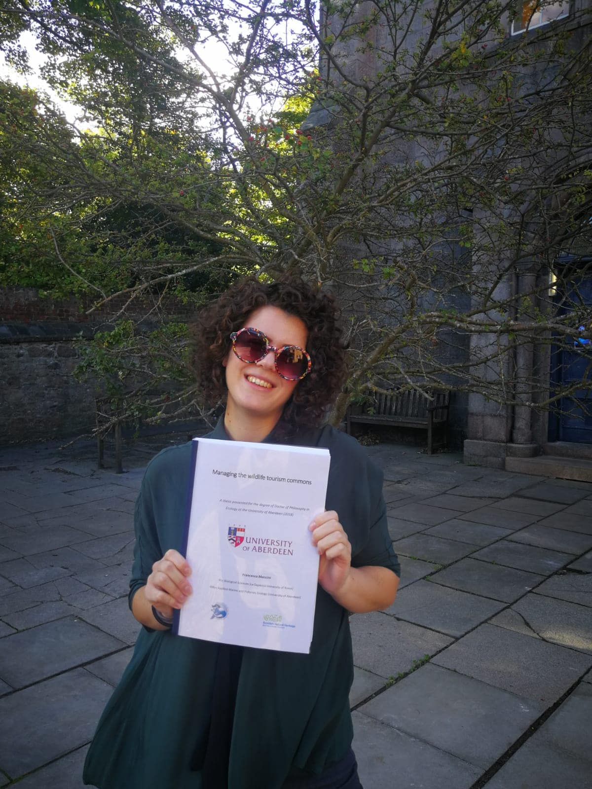

This time of the year many will be entering the last 6 months of their PhD. That was me a year ago. It doesn’t matter how many people who had been there before told me that it was going to be hard, I still thought that it was not going to happen to me, that I had been organised enough to avoid the rush to finish. I should have listened, and now I am one of those people who have been there before telling you, it is going to be tough!
I know that there are probably thousands of posts on how to survive the last months of your PhD, but everyone’s experience is different, and I wanted to contribute with my top 6 tips for making it through these very hard months and manage to keep your mental health.
### 1. Find something that you are really good at and do it at least a couple of times a week. 

For me it was yoga, I started taking regular classes during the last year of my PhD and it really helped! There is a lot of frustration, doubts and insecurities at the end of your PhD and doing something where you can see yourself improving every time and reaching little goals is very satisfying. Plus, exercise is a great way to take your mind off thesis work. I found that going to classes after work was improving my mood before going home and once there, I was actually able to relax without thoughts about my analysis creeping into my brain leading to sleepless nights.
### 2. Get crafty. 

Maybe redecorating your home in the last 9 months of your PhD is not a very good idea, but think smaller projects, for example knit a scarf, make little photo holders out of pebbles or something like that. These things require focus, so you can’t think about thesis work when you’re doing it and the finished product makes you feel like you have been creative and achieved something. 
### 3. It is OK to take some time to be alone. 

Friends and family are very important during tough periods of your life. However, stress is a terrible beast and I found myself snapping at my friends and partner a lot more often than usual towards the end of my PhD. Little things that I would not even have paid attention to normally become unbearably annoying and what feeble force was keeping me together would just give up and I would lash out in exaggerated reactions to silly misunderstandings. This does not include shouting to someone who just said to you: “Not much time left, uh?”, that is totally justified! 😊 So it is OK if sometimes you just want to be by yourself, maybe read a book, go for a walk or just sit with yourself in silence.
### 4.	Spend time with your friends and family. 

OK, this contradicts the previous one, but it just proves how crazy those last few months really are. I think I would have gone mad by the end of my PhD if it wasn’t for my friends and family. Sure, they drive you nuts sometimes, but they are also always there to cheer you up and give you much needed perspective. My dearest friends were so understanding and patient, especially my partner, putting up with my exaggerated reactions and mood swings (see above).
### 5.	Listen to your supervisor. 

I was very lucky to have a fantastic supervisor (shout-out to @d_lusseau) and he is one of the reasons why I didn’t go completely mental during those last few months. In general, it is a good idea to listen to your supervisor’s advice, more so at the end of your PhD, when chances are you are quickly running out of energy and enthusiasm. 
### 6.	You still need to take time off. 

After Christmas holydays I had decided I was not going to take time off until after I had handed in my thesis. That was a bad idea! Quickly I realised how much I needed a holyday and by July I was booking tickets to go back home for a while. I only really took a week off, but that time was so important to just relax and recharge. I got back to my thesis feeling a lot more focused and productive.

This is how I survived the last 6 months of my PhD. If you are going through that awful time now, let me tell you: hang in there, it will be over soon, and you can look forward to that “I can do anything!” feeling that you will have when you are handing in your thesis. There is light at the end of the tunnel, together with all the joy and happiness you might think you have lost while writing your thesis.

