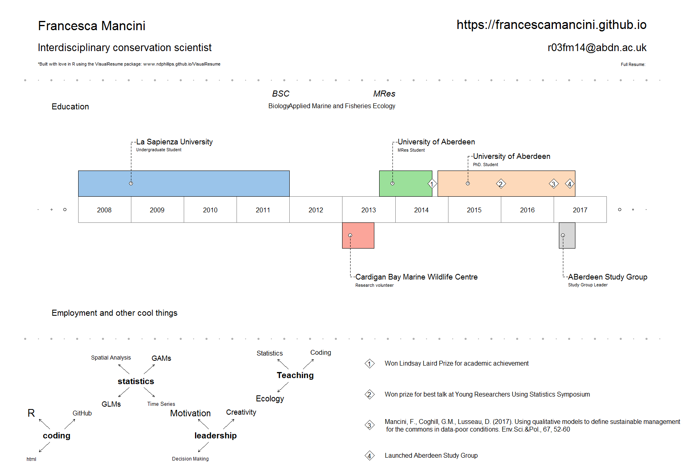

    

## What I do
I am a PhD student at the University of Aberdeen. My research is about finding sustainable management solutions for wildlife tourism.
I use unconventional data sources, such as social media, to quantify wildlife watching activities. I use different qualitative and quantitative techniques to answer questions relevant to management.
I am passionate about statistics, coding and open science. 
In my free time I enjoy watching films, reading books and swimming.

## Check out my Resume.

