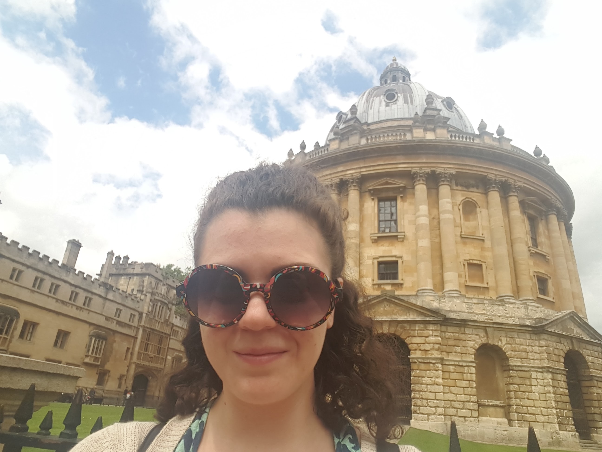

    

## What I do
I am an ecological modeller at the Centre for Ecology & Hydrology, looking at drivers of biodiversity change. During my PhD I investigated sustainable management solutions for wildlife tourism.
I used unconventional data sources, such as social media, to quantify wildlife watching activities and different qualitative and quantitative techniques to answer questions relevant to management.
I am passionate about statistics, coding and open science. 
In my free time I enjoy watching films, reading books and swimming.

## Check out my Resume.

